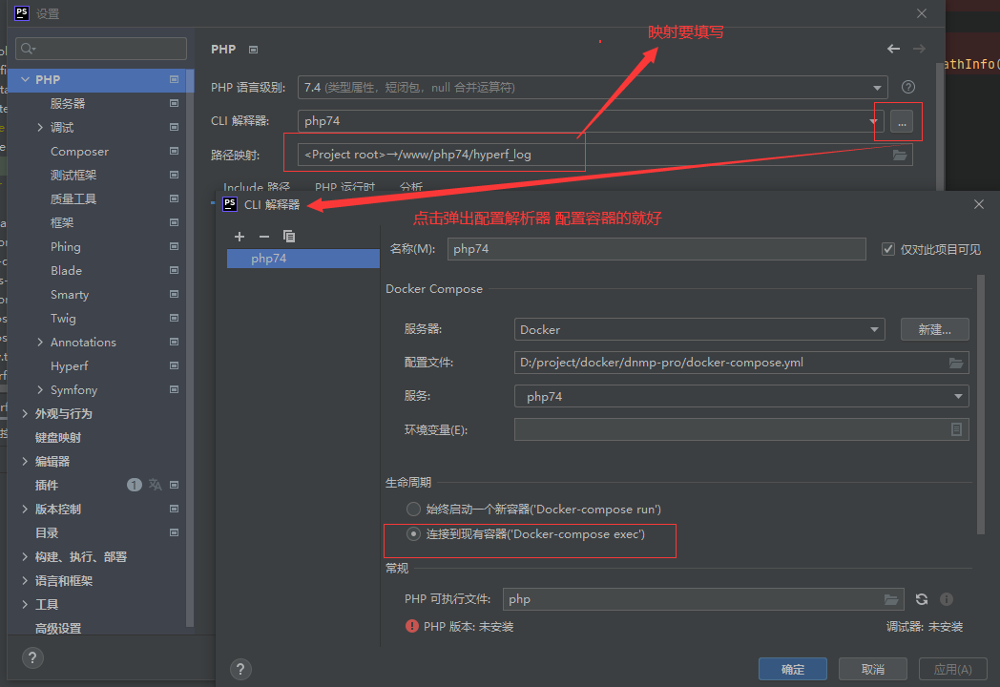
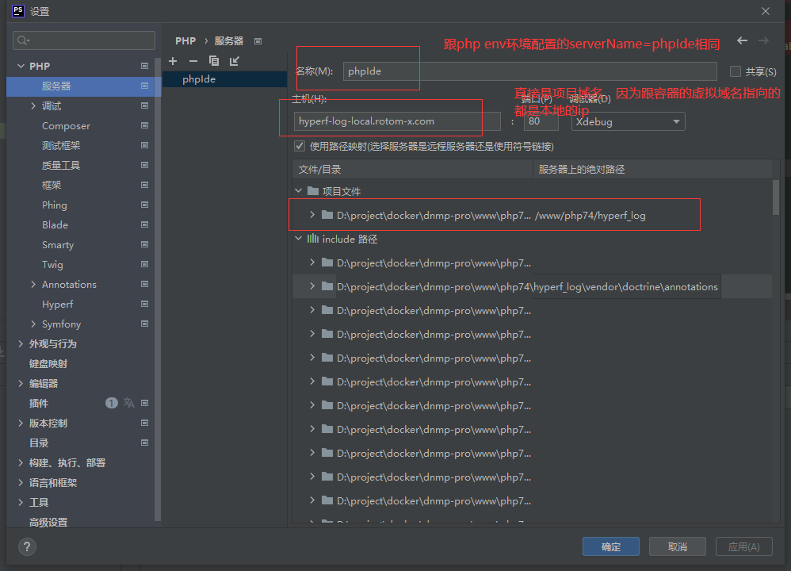
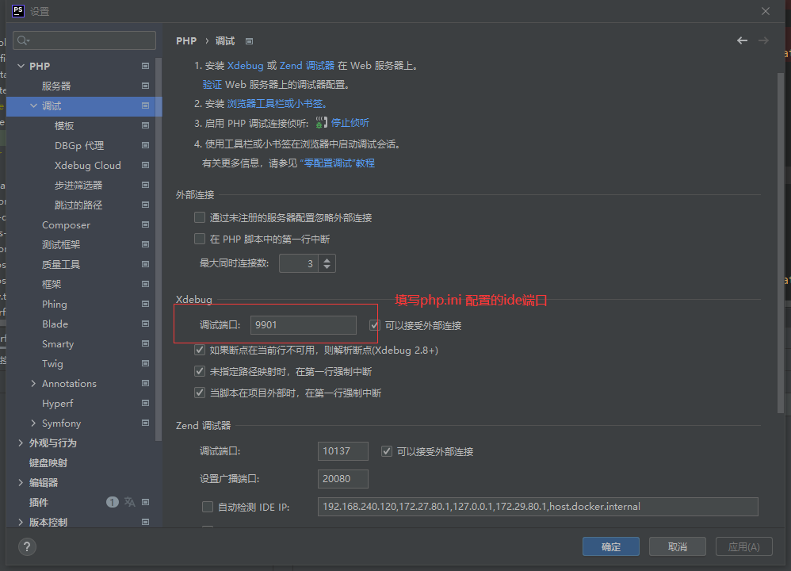
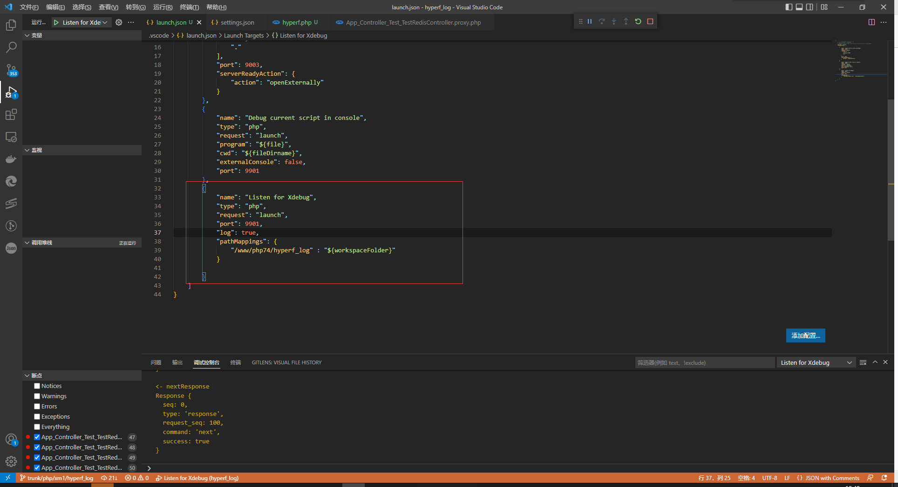
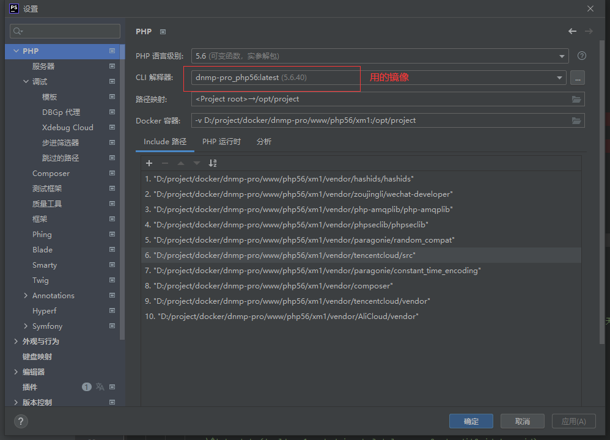
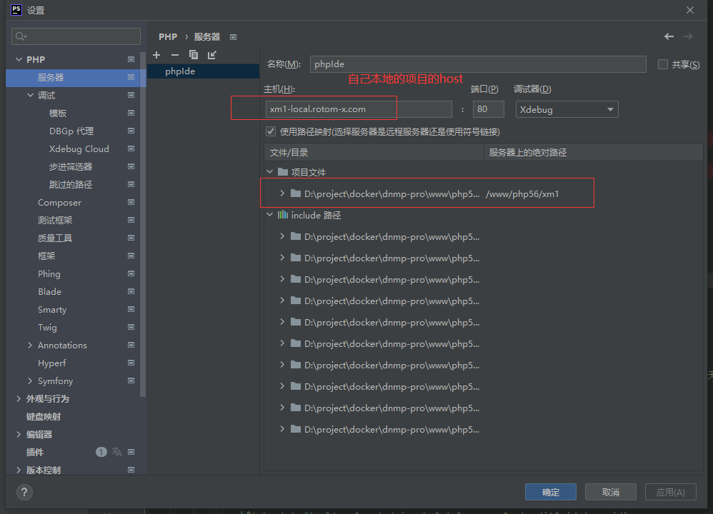
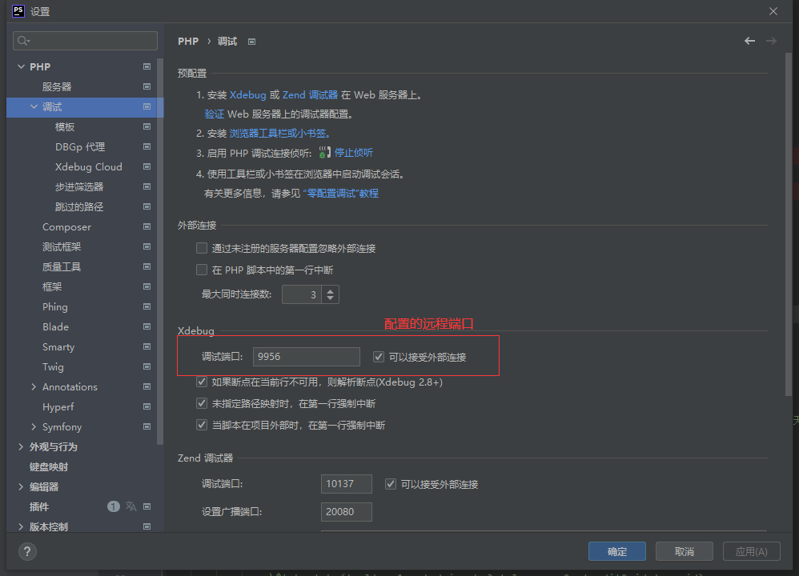
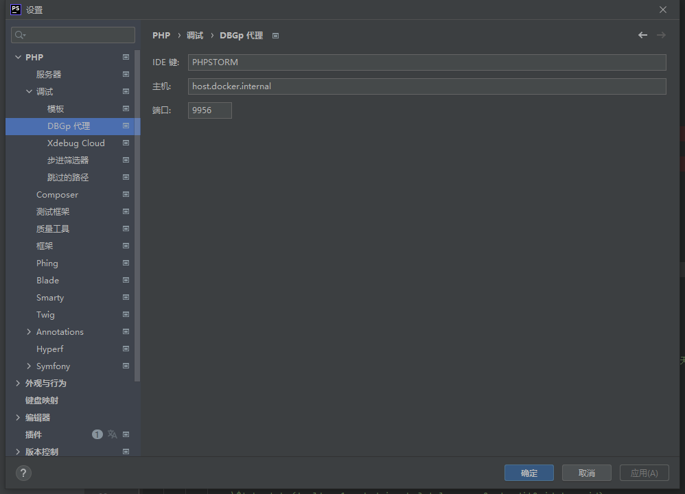
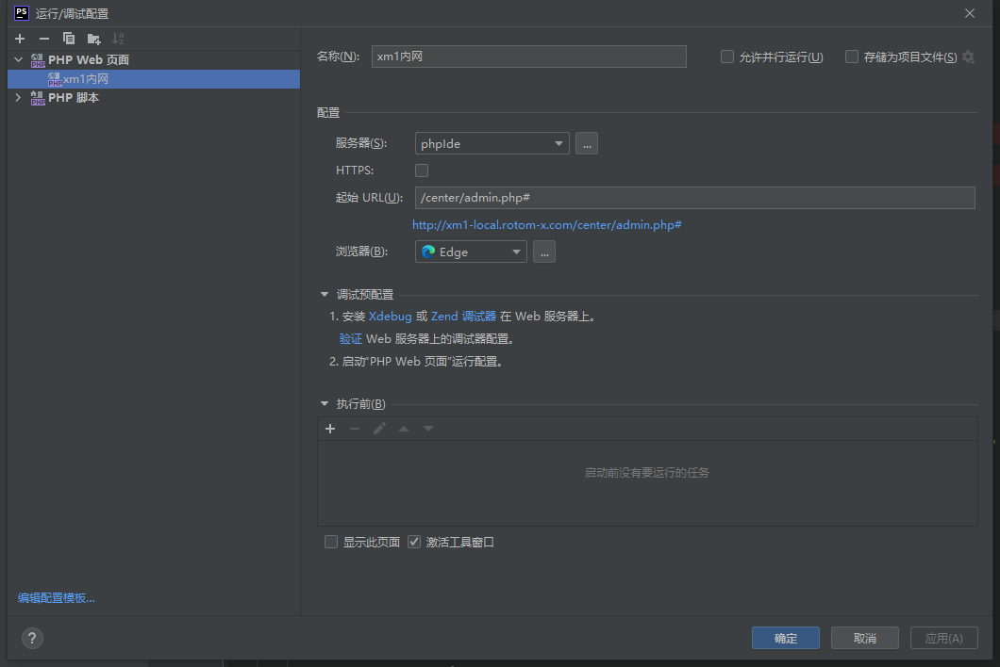
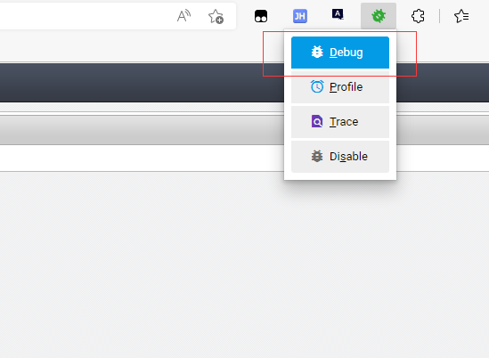

# 环境说明
环境原始来自[dnmp](https://github.com/yeszao/dnmp) ,稍做修改

## 开始
* 进入根目录
* 配置文件
  ```shell
  #
  cp docker-compose.diff-v2.yml docker-compose.yml
  cp env.diff-v2 .env
  ```
* 构建镜像和启动容器
  ```shell
  #构建和启动所有容器（根据个人情况不需要的环境可以在.env里面注释）
  docker-compose up
  ```

## debug调试
## php72以上使用yasd调试,php56使用xdebug调试
* 推荐使用 Yasd 进行 Swoole 调试，类似 Xdebug，支持php-fpm，完美支持协程，支持断点调试、单步追踪、watch 变量；
* php.ini 配置添加下面内容
  ```shell
    zend_extension=yasd.so
    ;使用远程调试远程调试
    yasd.debug_mode=remote
    ;本地开发地址 IDE所在的ip地址,如果是虚拟机,请填写虚拟机和宿主机通信的那个网卡的ip地址
    yasd.remote_host=host.docker.internal
    ;本地开发监听端口
    yasd.remote_port=9901
    ; 这样的话,相当于默认开启了php -e选项, 调试完记得注释掉
    yasd.open_extended_info=1
  ```
* docker-composer.yml文件修改如下
  ```shell
    #php74下面添加
    environment:
      XDEBUG_CONFIG: "idekey=PHPSTORM"
      PHP_IDE_CONFIG: "serverName=phpIde"
  ```
* .env文件里面添加yasd扩展
* 上面的在dnmp环境已经配好了（查看使用ysad安装成功 php -v 成功显示有：with Yasd v0.3.9-alpha, Our Copyright, by codinghuang）
* 特别说明：<font color=red>如果使用hyperf框架的话断点必须打到代理类</font>

## ide配置yasd(php7.2以上)
### 配置phpstrom 
* [参考1](https://github.com/swoole/yasd/issues/136) 
* [yasd](https://github.com/swoole/yasd)
* 
* 
* 
* 

### 配置vscode
* 配置launch.json
* 

## ide配置xdebug(php5.6-php7.1)-浏览器需要安装xdebug扩展
### 配置phpstrom 
* 
* 
* 
* 
* 
* 